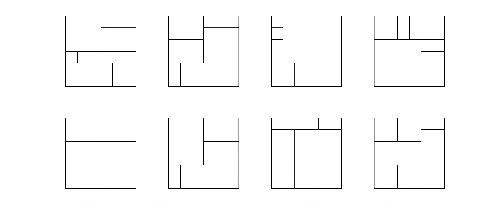
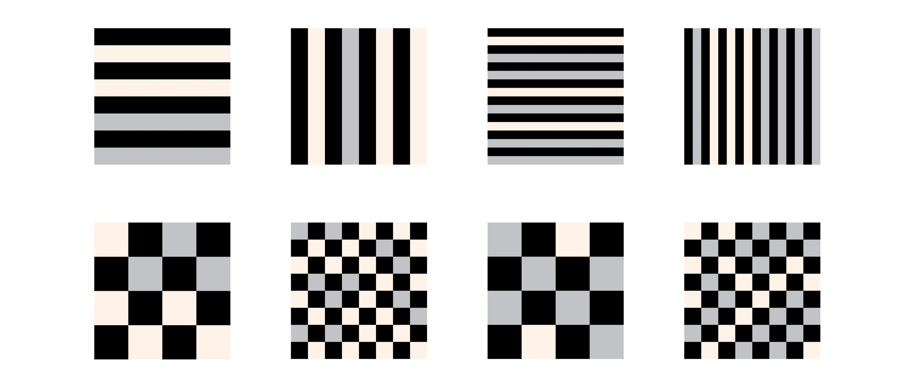
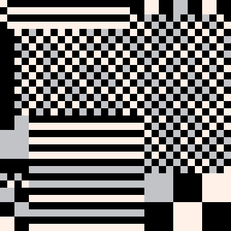

# Fusion Bricks - Generative Art with PICO-8

This project is reinterpretation of my initial fxhash project [Geometric Grid Fusion](https://www.fxhash.xyz/generative/24620) using Pico-8. 

## The alogrithm

The PICO-8 program generates a random, abstract pattern composed of rectangles and lines in black, white, and grey colors.

The program begins with an empty 128x128 black canvas and divides it recursively into smaller rectangles of random sizes until a specified limit is reached. The width and height of the rectangles can be one of the following values: 64, 32, 16, or 8 pixels. This ensures that the final results can be seamlessly adapted to a 32x32 LEGO board.

<div style="display:block;margin:auto;height:75%;width:75%">
    
</div>

</br>

For each rectangle, the algorithm determines whether to draw smaller squares or lines within it. The colors, as well as the direction of the lines (horizontal or vertical), are also randomly decided. The sizes of squares and lines are chosen randomly, taking into account the size of the corresponding rectangle.

<div style="display:block;margin:auto;height:70%;width:70%">
    
</div>

</br>

Below is a gif showcasing a few outputs of the PICO-8 generative algorithm, providing a glimpse into the range of abstract patterns and textures that the algorithm can generate. Each output is unique and showcases the unpredictable yet intriguing nature of generative art.

<div style="text-align:center;">
    
</div>

## Requirements
- PICO-8 software from Lexaloffle Games (https://www.lexaloffle.com/pico-8.php)
- Basic understanding of PICO-8 and its Lua-based programming

## Installation
The Fusion Bricks program runs on PICO-8, and you should load it through the software:

1. Open PICO-8
2. Load the fusion_bricks.p8 file:

```
LOAD fusion_bricks.p8
```

## Usage
Run the PICO-8 program:

```
RUN
```

## License
This project is licensed under the terms of the MIT license.

